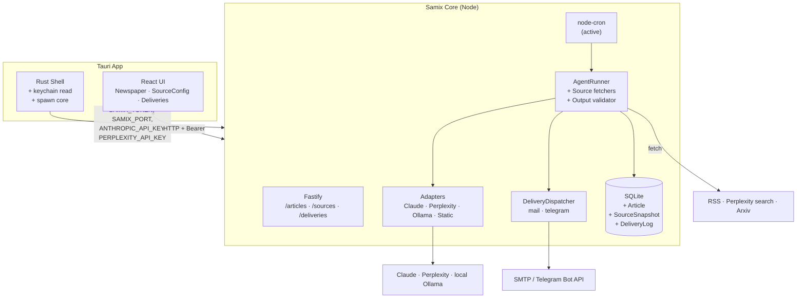

# Samix — Phase 1 Architecture Spec

**Version:** 1.0 (Phase 1, first proactive agent)
**Status:** Draft for implementation
**Last updated:** 2026-04-18
**Builds on:** `SAMIX_PHASE_0_SPEC.md` (pipeline), `SAMIX_PHASE_0_REPORT.md` (what shipped)
**Prioritization:** Architektur-Sauberkeit > Kosten-Effizienz > Time-to-MVP

---

## 0. Naming Context

Samix ist die lokale Desktop-Anwendung, die ein hierarchisches Multi-Agent-System beherbergt. Werte und Namensherkunft sind in `SAMIX_ABOUT.md` dokumentiert — dieses Dokument baut darauf auf und spezifiziert, *was* in Phase 1 gebaut wird.

Phase 0 hat die Pipeline validiert (`StaticAdapter` + `hello-world`). Phase 1 liefert den ersten nutzbaren Agenten.

---

## 1. Goal

Der erste **proactive Agent** (`newsletter-ai`) läuft end-to-end:

- zeitgesteuert per Cron
- zieht Quellen aus RSS, Perplexity-Search und Arxiv
- ruft echte LLMs (Claude + Perplexity + Ollama als Fallback)
- validiert Output gegen ein JSON Schema
- persistiert `Article`-Zeilen mit Citations
- rendert im Newspaper-UI
- liefert extern via Mail (SMTP) und Telegram aus

**Explizite Non-Goals für Phase 1:** Orchestrator (Phase 4), reactive Coding-Agents (Phase 3), Cross-Agent-Memory (Phase 4+), Tray-Icon + Autostart (Phase 2), OpenAI-Adapter, Voting/Personalisierung, Retention-Policy.

---

## 2. Core Principles (recap)

Alle acht Werte aus `SAMIX_ABOUT.md` gelten unverändert. Phase 1 stresst drei davon besonders:

- **Model-agnostic** — erstmals müssen mindestens zwei Provider wirklich funktionieren (Claude + Ollama als Fallback). Der `ModelAdapter`-Layer darf nicht leaken.
- **Source-traceable** — in Phase 0 war das theoretisch; Phase 1 macht es zur Laufzeit-Pflicht. Der Output-Validator lehnt Artikel ohne URL + Datum ab.
- **Budget-disciplined** — in Phase 0 waren Kosten null. Ab jetzt fließt echtes Geld; `SAMIX_GLOBAL_DAILY_USD_MAX` wird zur echten Schutzschranke, die *vor* dem Adapter-Call geprüft wird.

---

## 3. Confirmed Decisions

| Entscheidung | Wert |
|---|---|
| Erster proactive Skill | `newsletter-ai` |
| Aktive LLM-Adapter | Claude (Haiku + Sonnet), Perplexity (Sonar), Ollama (lokal) |
| Kein OpenAI | verschoben auf Phase 2+ — lokal + Perplexity + Claude deckt Research, Summarize und Fallback ab |
| Source-Typen | RSS, Perplexity-Search, Arxiv |
| Secrets-Storage | OS-Keychain via Rust `keyring`-Crate; pro Account (`anthropic`, `perplexity`, `smtp`, `telegram`) |
| Secret-Flow | Rust-Shell liest Keychain → exportiert als ENV beim Core-Spawn → Core liest aus `process.env` |
| Delivery-Kanäle | SMTP (Mail), Telegram Bot API |
| Newspaper-Layout | Single-Column-Card-Liste, gruppiert nach Tag, Click → Detail mit Citation |
| Source-Config-UI | In-App-Form, schreibt zurück in `agents/<slug>/manifest.yaml` |
| Output-Validation | JSON Schema pro Skill (Datei neben `manifest.yaml`) |
| Scheduler | `node-cron` aktiviert; pro proactive Skill ein Job; `catchup_on_startup` implementiert |
| Package-Manager, Build | unverändert zu Phase 0 |

---

## 4. High-Level Architecture



Drei strukturelle Erweiterungen gegenüber Phase 0:

1. **Scheduler ist live.** Der Runner wird nicht mehr nur reaktiv (manual trigger) aufgerufen, sondern auch zeitgesteuert.
2. **Source-Fetchers** sitzen zwischen Runner und Außenwelt. Sie laufen *vor* dem Adapter-Call und liefern strukturierten Input.
3. **DeliveryDispatcher** ist ein Post-Run-Side-Effect: nach einem erfolgreichen Run werden die erzeugten `Article`-Zeilen an Mail/Telegram übergeben.

---

## 5. Project Structure (Deltas vs. Phase 0)

Nur neue oder geänderte Pfade — alles andere bleibt wie in Phase 0 §5.

```
core/src/
├── sources/
│   ├── base.ts              # SourceFetcher interface
│   ├── rss.ts
│   ├── perplexity.ts        # search via Perplexity API
│   └── arxiv.ts
├── delivery/
│   ├── dispatcher.ts
│   ├── mail.ts
│   └── telegram.ts
├── output/
│   └── validator.ts          # JSON Schema validation
├── adapters/
│   ├── perplexity.ts         # neu
│   └── ollama.ts             # neu
└── scheduler/
    └── index.ts              # ersetzt Phase-0-No-op

agents/newsletter-ai/
├── SKILL.md
├── manifest.yaml
└── schema.json               # Output-Validierungs-Schema

app/src/
├── pages/
│   ├── Newspaper.tsx
│   ├── Sources.tsx
│   └── Deliveries.tsx
└── components/SidebarNav.tsx

app/src-tauri/src/
└── keychain.rs               # Secrets-Commands
```

---

## 6. Secrets Flow (keychain → ENV → core)

### Gründe für Keychain statt `.env`

Local-first erlaubt keine Secrets in Git-verwalteten Dateien. Ein `.env` im Home-Verzeichnis wäre möglich, aber auf dem Dateisystem lesbar — die OS-Keychain bietet Prozess-isolierten Zugriff und ist der plattform-native Standard.

### Flow

1. **First-run:** User öffnet Settings-Page in der Tauri-App, gibt API-Keys ein.
2. UI ruft Tauri-Command `set_secret(account, value)` auf — Rust schreibt via `keyring`-Crate in die OS-Keychain (Service-Name: `samix`).
3. **Bei jedem App-Start:** Rust-Shell liest alle bekannten Accounts aus der Keychain, setzt sie als ENV beim Core-Spawn (`ANTHROPIC_API_KEY`, `PERPLEXITY_API_KEY`, `SMTP_HOST`, `SMTP_USER`, `SMTP_PASS`, `SMTP_FROM`, `TELEGRAM_BOT_TOKEN`, `TELEGRAM_CHAT_ID`).
4. Core liest `process.env.*` wie gehabt — kein Code-Weg zwischen Keychain und Core.

### Tauri-Commands (neu)

- `set_secret(account: String, value: String) -> Result<(), String>`
- `has_secret(account: String) -> bool` — für UI-Anzeige "configured"
- `delete_secret(account: String)` — für Reset

Keine `get_secret`-Command — Secrets verlassen Rust nur via ENV beim Core-Spawn, nie zurück in die WebView.

### ADR

→ `docs/decisions/004-os-keychain-for-secrets.md`

---

## 7. Source Fetchers

### Interface

```typescript
// core/src/sources/base.ts
export interface SourceItem {
  url: string;
  title: string;
  snippet?: string;
  publishedAt?: Date;
  sourceName: string;         // "TechCrunch", "arxiv:cs.AI", "perplexity"
  raw?: Record<string, unknown>;
}

export interface SourceFetcher<C = unknown> {
  readonly type: 'rss' | 'perplexity_search' | 'arxiv';
  fetch(config: C, ctx: FetchContext): Promise<SourceItem[]>;
}

export interface FetchContext {
  runId: string;
  logger: Logger;
  since?: Date;               // only fetch items newer than this
}
```

### Per-Source-Config (aus `manifest.yaml`)

```yaml
sources:
  - type: rss
    config:
      urls: ["https://..."]
      maxPerFeed: 20
  - type: perplexity_search
    config:
      queries: ["AI agent architectures 2026"]
      recencyHours: 24
  - type: arxiv
    config:
      categories: ["cs.AI", "cs.CL"]
      query: "large language models"
      maxResults: 15
```

### Ablauf im Runner

1. Für jeden `SourceSpec` in `manifest.sources`: passenden Fetcher auflösen.
2. `fetch()` aufrufen, `SourceItem[]` einsammeln.
3. Jedes Item **persistieren als `SourceSnapshot`-Zeile** — auch wenn der LLM es später verwirft. Das ist die Traceability-Grundlage.
4. Items als Kontext an den Adapter geben (als strukturierte Liste im User-Message oder — wenn Adapter Tools unterstützt — als Tool-Result).
5. LLM wählt/summiert/filtert → Output durchläuft Validator → `Article`-Zeilen.

### RSS-Library

**Verified (April 2026):** `rss-parser` (rbren) ist seit ~3 Jahren ohne Release — nicht als Primär-Wahl geeignet. Aktive Alternativen:

- **`feedsmith`** — moderner All-in-One-Parser für RSS/Atom/RDF/JSON Feed, TS-nativ, ESM. Primär-Wahl.
- **`@rowanmanning/feed-parser`** — ESM + CommonJS, aktiv gepflegt; Fallback, falls `feedsmith` unerwartete Edge-Cases hat.

### Perplexity Search API (Sonar)

**Verified (April 2026, docs.perplexity.ai):**

- Base URL: `https://api.perplexity.ai`
- Endpoint: `POST /chat/completions` — OpenAI-kompatibles Chat-Completions-Format
- Auth: `Authorization: Bearer <PERPLEXITY_API_KEY>`
- Modelle: `sonar` (Standard), `sonar-pro` (tiefere Recherche, mehr Citations)
- Relevante Parameter: `search_recency_filter: 'hour' | 'day' | 'week' | 'month'`, `search_domain_filter: string[]`, `return_related_questions: boolean`
- Citations liegen als `citations`-Feld im Response-Body; bei Streaming-Responses in den `data:`-Zeilen

Der `PerplexityAdapter` nutzt `sonar` als Default; `sonar-pro` erst wenn `routing.research_deep` in einem zukünftigen Skill benötigt wird.

### Arxiv API

**Verified (April 2026, info.arxiv.org/help/api):**

- Base URL: `http://export.arxiv.org/api/query`
- Response-Format: **Atom 1.0** (nicht JSON — ein Atom-Parser wird gebraucht; `feedsmith` kann das)
- Rate-Limit: **3 Requests/Sekunde** — mit Puffer betreiben (z. B. 1 req/s). Seit Feb 2026 werden vermehrt HTTP 429 trotz eingehaltener Delays gemeldet; der Fetcher muss 429-Retry-with-Backoff implementieren.
- Query-Felder: `ti` (Titel), `au` (Autor), `abs` (Abstract), `cat` (Kategorie), `id` (ArXiv-ID)
- Pagination: `start` + `max_results` (max 2000 pro Query)
- Keine Authentifizierung

---

## 8. Adapter Additions

### ClaudeAdapter aktivieren

Der Phase-0-Stub in `core/src/adapters/claude.ts` ist bereits korrekt implementiert. Phase 1 aktiviert ihn in der Registry.

**Verified pricing (April 2026, Anthropic API):**

| Model | Input ($/M tokens) | Output ($/M tokens) |
|---|---|---|
| `claude-haiku-4-5` | 1.00 | 5.00 |
| `claude-sonnet-4-6` | 3.00 | 15.00 |
| `claude-opus-4-7` | 5.00 | 25.00 |

Follow-up: `core/src/types.ts` enthält noch `claude-sonnet-4-5` im `ModelId`-Union — das ist veraltet und muss beim Aktivieren des Adapters auf `claude-sonnet-4-6` umgestellt werden. Opus 4.7 wird in Phase 1 nicht genutzt (zu teuer für tägliche Newsletter-Runs) und bleibt vorerst außerhalb der Registry.

### PerplexityAdapter (neu)

```typescript
// core/src/adapters/perplexity.ts
export class PerplexityAdapter implements ModelAdapter {
  readonly name = 'perplexity-sonar' as const;
  readonly supportsTools = false;
  readonly supportsSearch = true;           // nutzt native Search
  readonly pricing = { /* VERIFY vor Go-live */ };
  async generate(req: NormalizedRequest): Promise<NormalizedResponse> { … }
}
```

Die Response enthält Citations direkt vom Provider — der Adapter muss diese in `NormalizedResponse.citations` mappen (URL + Titel + optional Datum). Damit wird Perplexity zur bevorzugten Quelle für `routing: { research: … }`.

### OllamaAdapter (neu)

```typescript
// core/src/adapters/ollama.ts
export class OllamaAdapter implements ModelAdapter {
  readonly name = 'ollama-llama3' as const;
  readonly supportsTools = false;
  readonly supportsSearch = false;
  readonly pricing = { inputPerMillionTokens: 0, outputPerMillionTokens: 0 };
  async generate(req: NormalizedRequest): Promise<NormalizedResponse> { … }
}
```

Basis-URL: `http://127.0.0.1:11434` (Ollama-Default). Bei Init: Kurzer `/api/version`-Check. Unreachable → Adapter entfernt sich selbst aus der Routing-Fallback-Kette und loggt eine Warnung (keine harte Startup-Failure — nur Fallback entfällt).

### Registry-Erweiterung

`core/src/adapters/index.ts` bekommt drei neue Einträge. Die `ModelId`-Union in `core/src/types.ts` bleibt fixed (kein stringly-typed) und wird um die neuen IDs erweitert.

### ADR

→ `docs/decisions/005-ollama-as-fallback.md`

---

## 9. Skill Format v1.1

Der Phase-0-Schema-Shape bleibt; folgende Felder werden erstmals *wirklich verwendet*:

- `model.routing` — pro logischer Aufgabe ein Adapter (`research`, `summarize`, `fallback`). Der Runner verwendet das Routing, wenn der Skill-Code mehrere Phasen durchläuft (oder, für Phase 1, hardcoded in `newsletter-ai`-Logik).
- `model.fallback` — wird bei Adapter-Fehler (Netzwerk, Rate-Limit, API-Error) automatisch versucht.
- `sources` — aktiv, siehe §7.
- `schedule` — aktiv, siehe §14.
- `output.schema` — Pfad (relativ zur SKILL.md) auf eine JSON-Schema-Datei; Validator prüft darauf, siehe §15.
- `output.min_items` / `max_items` — vom Validator erzwungen.

### `agents/newsletter-ai/manifest.yaml` (konkret)

```yaml
id: newsletter-ai
type: proactive
version: "1.0"

model:
  primary: claude-haiku-4-5
  fallback: ollama-llama3
  routing:
    research: perplexity-sonar
    summarize: claude-haiku-4-5

budget:
  daily_usd_max: 0.50
  tokens_per_run_max: 50000
  halt_on_budget_exceeded: true

schedule:
  cron: "0 6 * * *"
  timezone: Europe/Berlin
  jitter_seconds: 30
  catchup_on_startup: true

sources:
  - type: rss
    config:
      urls: [...]            # vom User via UI konfiguriert
      maxPerFeed: 20
  - type: perplexity_search
    config:
      queries: [...]
      recencyHours: 24
  - type: arxiv
    config:
      categories: ["cs.AI"]
      maxResults: 10

output:
  format: newsletter_items
  schema: ./schema.json
  min_items: 5
  max_items: 10
```

### `agents/newsletter-ai/schema.json` (konkret)

```json
{
  "$schema": "https://json-schema.org/draft/2020-12/schema",
  "type": "object",
  "required": ["items"],
  "properties": {
    "items": {
      "type": "array",
      "minItems": 5,
      "maxItems": 10,
      "items": {
        "type": "object",
        "required": ["title", "summary", "sourceUrl"],
        "properties": {
          "title": { "type": "string", "maxLength": 200 },
          "summary": { "type": "string", "maxLength": 280 },
          "sourceUrl": { "type": "string", "format": "uri" },
          "publishedAt": { "type": "string", "format": "date-time" },
          "topic": { "type": "string" }
        }
      }
    }
  }
}
```

### ADR

→ `docs/decisions/006-output-json-schema-validator.md`

---

## 10. Core Type System (Diff gegen Phase 0)

Neu in `core/src/types.ts`:

```typescript
export type DeliveryChannelType = 'mail' | 'telegram';

export interface SourceItem {
  url: string;
  title: string;
  snippet?: string;
  publishedAt?: Date;
  sourceName: string;
  raw?: Record<string, unknown>;
}

export interface SourceFetcher<C = unknown> {
  readonly type: 'rss' | 'perplexity_search' | 'arxiv';
  fetch(config: C, ctx: FetchContext): Promise<SourceItem[]>;
}

export interface FetchContext {
  runId: string;
  logger: Logger;
  since?: Date;
}

export interface DeliveryChannel {
  readonly type: DeliveryChannelType;
  send(payload: DeliveryPayload): Promise<DeliveryResult>;
}

export interface DeliveryPayload {
  runId: string;
  agentSlug: string;
  articles: ArticleSummary[];
  renderedAt: Date;
}

export interface DeliveryResult {
  channel: DeliveryChannelType;
  status: 'sent' | 'failed';
  error?: string;
  sentAt: Date;
}

export interface OutputValidator {
  validate(raw: unknown, schemaPath: string): ValidationResult;
}

export interface ValidationResult {
  valid: boolean;
  errors?: string[];
  parsed?: unknown;
}
```

Erweitert:

```typescript
export interface RunResult {
  // … Phase-0-Felder unverändert …
  articleIds: string[];
  deliveries: DeliveryResult[];
}
```

---

## 11. Prisma Schema (Additions only)

`Article` existiert bereits aus Phase 0 (ungenutzt bis jetzt) — keine Schema-Änderung, nur Runtime-Befüllung.

Neu:

```prisma
model SourceSnapshot {
  id          String   @id @default(uuid())
  agentRunId  String
  agentRun    AgentRun @relation(fields: [agentRunId], references: [id])
  sourceType  String           // 'rss' | 'perplexity_search' | 'arxiv'
  sourceName  String
  url         String
  title       String
  publishedAt DateTime?
  fetchedAt   DateTime @default(now())
  raw         String?          // JSON-serialized raw item

  @@index([agentRunId])
  @@index([url])
}

model DeliveryLog {
  id         String   @id @default(uuid())
  agentRunId String
  agentRun   AgentRun @relation(fields: [agentRunId], references: [id])
  channel    String           // 'mail' | 'telegram'
  status     String           // 'sent' | 'failed'
  error      String?
  sentAt     DateTime @default(now())

  @@index([agentRunId])
}

model DeliverySchedule {
  id        String   @id @default(uuid())
  channel   String   @unique  // 'mail' | 'telegram'
  config    String            // JSON-serialized channel config (non-secret fields only)
  enabled   Boolean  @default(false)
  updatedAt DateTime @updatedAt
}
```

**Kein `Secret`-Model** — Secrets liegen in der Keychain, nie in der DB.

`AgentRun` braucht neue Relations:

```prisma
model AgentRun {
  // … bestehende Felder …
  snapshots  SourceSnapshot[]
  deliveries DeliveryLog[]
}
```

---

## 12. HTTP API (neue Endpoints)

Alle token-authentifiziert, `/health` bleibt offen.

| Method | Path | Zweck |
|---|---|---|
| `GET` | `/articles?since=&topic=&agent=` | Articles abrufen, gefiltert |
| `GET` | `/articles/:id` | Single Article mit Snapshots |
| `GET` | `/agents/:slug/sources` | aktuelle `sources:`-Config aus Manifest |
| `PUT` | `/agents/:slug/sources` | Sources schreiben (Manifest auf Disk + Reload) |
| `GET` | `/deliveries` | Delivery-Logs + Schedule-State |
| `PUT` | `/deliveries/:channel` | Channel enable/disable + Config |
| `POST` | `/deliveries/:channel/test` | Test-Send ohne echten Run |

Bestehende Endpoints (`/agents`, `/agents/:slug/run`, `/runs/:id`, `/health`) unverändert.

---

## 13. UI (drei Seiten hinter Sidebar)

Sidebar-Navigation (shadcn `NavigationMenu` oder einfache Custom-Links):

- **Newspaper** (Default) — kartenbasiertes Layout, Articles gruppiert nach `createdAt`-Tag, absteigend. Jede Karte: Titel, Summary, Source-Name, `Open`-Button (öffnet URL extern via `@tauri-apps/plugin-opener`). Detail-View bei Click.
- **Sources** — pro Agent ein Abschnitt; Form zum Bearbeiten der `sources:`-Liste (RSS-URLs add/remove, Perplexity-Queries edit, Arxiv-Categories). Save → `PUT /agents/:slug/sources` → Core schreibt Manifest neu und lädt es neu.
- **Deliveries** — SMTP-Section (Host, Port, User, From, Password → Keychain), Telegram-Section (Bot-Token → Keychain, Chat-ID). Enable-Toggle pro Channel. Test-Send-Button. Letzte N Delivery-Logs als Liste.

UI-Library: weiterhin shadcn/ui. Neue Komponenten: `Card`, `Input`, `Form`, `Tabs`, `Separator`, `Alert`. Keine neuen UI-Libs.

State: `@tanstack/react-query` wie gehabt. Mutationen invalidieren passende Queries.

---

## 14. Scheduler Activation

Der Phase-0-No-op in `core/src/scheduler/index.ts` wird ersetzt:

```typescript
export function startScheduler(skills: Skill[], logger: Logger): void {
  for (const skill of skills.filter(s => s.type === 'proactive' && s.manifest.schedule)) {
    const { cron, timezone, jitterSeconds = 0, catchupOnStartup = false } = skill.manifest.schedule!;

    // catchup: on boot, fire once if last successful run is older than one interval
    if (catchupOnStartup) {
      void maybeCatchup(skill, logger);
    }

    nodeCron.schedule(cron, async () => {
      await delay(randomInt(0, jitterSeconds * 1000));
      await runAgent({ skill, trigger: 'schedule', logger });
    }, { timezone });

    logger.info({ slug: skill.id, cron, timezone }, 'schedule_registered');
  }
}
```

- **Jitter** — gleichverteilt in `[0, jitterSeconds]` Sekunden vor dem tatsächlichen Call.
- **Catchup** — beim Boot prüft der Scheduler für jeden Skill den letzten `AgentRun` mit `status='success'`. Ist dieser älter als ein Cron-Intervall, wird ein Catchup-Run mit `trigger: 'catchup'` gefeuert (einmalig, nicht wiederholt).
- **Live-Reload** — beim Umladen eines Skills (via Sources-UI) werden alle bisherigen Jobs für diesen Skill gestoppt und neu registriert.

---

## 15. Output Validation

```typescript
// core/src/output/validator.ts
import Ajv from 'ajv';
import addFormats from 'ajv-formats';

// Verified (April 2026): ajv 8.18.x + ajv-formats 3.0.x.
// ajv-formats 3 requires Ajv v7+; both compatible on Node 20 LTS.
export class JsonSchemaValidator implements OutputValidator { … }
```

### Ablauf im Runner

1. Adapter liefert `NormalizedResponse.content` (rohes String, hoffentlich JSON).
2. Runner parst JSON.
3. Validator lädt das JSON-Schema aus `manifest.output.schemaPath` (relativ zur SKILL.md).
4. Validierung:
   - **Success:** `Article`-Zeilen pro `items[]`-Element anlegen, mit Citation aus `sourceUrl`/`publishedAt`.
   - **Failure:** `AgentRun.status = 'partial'`, Fehlermeldung in `AgentRun.error`, Raw-Output in `AgentRun.output`, **keine** `Article`-Zeilen, **keine** Delivery.

Damit wird der Source-traceable-Wert im Code erzwungen: ein Artikel ohne `sourceUrl` ist ein Schema-Violation, kein valides Output.

---

## 16. Delivery

### DeliveryDispatcher

```typescript
// core/src/delivery/dispatcher.ts
export class DeliveryDispatcher {
  async run(agentRun: AgentRun, articles: Article[]): Promise<DeliveryResult[]> {
    const schedules = await prisma.deliverySchedule.findMany({ where: { enabled: true } });
    const results: DeliveryResult[] = [];
    for (const sched of schedules) {
      const channel = this.channels.get(sched.channel);
      if (!channel) continue;
      try {
        const result = await channel.send({ runId: agentRun.id, agentSlug: …, articles, renderedAt: new Date() });
        results.push(result);
      } catch (err) {
        results.push({ channel: sched.channel, status: 'failed', error: String(err), sentAt: new Date() });
      }
      await prisma.deliveryLog.create({ data: { … } });
    }
    return results;
  }
}
```

### Channel-Implementierungen

- **Mail** — `nodemailer` (etabliert, ESM-kompatibel). HTML-Template als simple Template-String-Function — kein Templating-Engine in Phase 1.
- **Telegram** — direkte HTTP-Calls an `https://api.telegram.org/bot<token>/sendMessage`, Markdown-formatiert, je Artikel eine Zeile mit Link.

### Fehler-Semantik

Delivery-Fehler flippen den `AgentRun.status` **nicht** auf `failed` — der Run war erfolgreich, nur die Auslieferung nicht. Fehler landen in `DeliveryLog` und sind in der Deliveries-UI sichtbar.

---

## 17. Environment Variables

Neu in Phase 1:

```bash
# API-Keys (aus Keychain injiziert)
ANTHROPIC_API_KEY=...
PERPLEXITY_API_KEY=...

# SMTP (aus Keychain injiziert)
SMTP_HOST=...
SMTP_PORT=587
SMTP_USER=...
SMTP_PASS=...
SMTP_FROM=samix@example.com

# Telegram (aus Keychain injiziert)
TELEGRAM_BOT_TOKEN=...
TELEGRAM_CHAT_ID=...

# Global cap — ab jetzt real
SAMIX_GLOBAL_DAILY_USD_MAX=5.00
```

Unverändert aus Phase 0: `SAMIX_PORT`, `SAMIX_TOKEN`, `DATABASE_URL`, `SAMIX_LOG_LEVEL`.

Der globale USD-Cap wird *vor* jedem Adapter-Call geprüft (Summe aller Ledgers für den aktuellen Tag). Überschreitung → `runAgent` scheitert mit `reason: 'global_budget_exceeded'`.

---

## 18. Phase 1 Deliverables

### Core

- [ ] `SourceFetcher`-Interface + Implementierungen für RSS, Perplexity-Search, Arxiv
- [ ] `PerplexityAdapter`, `OllamaAdapter`; `ClaudeAdapter` aktiviert in Registry
- [ ] `OutputValidator` (JSON Schema via Ajv)
- [ ] `DeliveryDispatcher` + `MailChannel` + `TelegramChannel`
- [ ] Scheduler: Cron-Registrierung, Jitter, Catchup-on-Startup, Live-Reload
- [ ] Runner: Source-Fetch-Phase, Schema-Validation-Phase, Delivery-Phase
- [ ] Globale Budget-Vorprüfung

### HTTP

- [ ] `GET /articles`, `GET /articles/:id`
- [ ] `GET /agents/:slug/sources`, `PUT /agents/:slug/sources`
- [ ] `GET /deliveries`, `PUT /deliveries/:channel`, `POST /deliveries/:channel/test`

### App

- [ ] Sidebar-Nav mit Newspaper / Sources / Deliveries
- [ ] Newspaper-Page (Card-Liste gruppiert nach Tag + Detail-View)
- [ ] Sources-Page (Manifest-Editor für `sources:`)
- [ ] Deliveries-Page (SMTP + Telegram Config, Test-Send, Log-Liste)
- [ ] Secrets-Eingabe über Settings-Page → Keychain

### Rust

- [ ] `keychain.rs` mit `set_secret`, `has_secret`, `delete_secret`
- [ ] Spawn-Schritt: Keychain → ENV → Core-Child-Prozess
- [ ] Auto-Spawn Core in Dev (Phase-0.5-Follow-up aus Report)

### Agents

- [ ] `agents/newsletter-ai/SKILL.md` + `manifest.yaml` + `schema.json`

### Docs

- [ ] `SAMIX_PHASE_1_SPEC.md` (dieses Dokument)
- [ ] `SAMIX_PHASE_1_CLAUDE_CODE_HANDOFF.md` (Implementation-Playbook, separat)
- [ ] ADRs 004, 005, 006
- [ ] README aktualisiert: Secrets-Setup, Ollama-Prereq, Delivery-Prereqs

---

## 19. Acceptance Criteria

1. User öffnet Settings-Page, gibt Anthropic- + Perplexity-Keys + SMTP-Credentials ein → alle in OS-Keychain gespeichert, kein Wert im Filesystem.
2. App-Restart → Core bootet mit Keys aus ENV, Logs zeigen `adapter_ready` für `claude-haiku-4-5`, `perplexity-sonar`, `ollama-llama3`.
3. `POST /agents/newsletter-ai/run` (manual trigger) → `status='success'`, ≥ 5 `Article`-Zeilen mit `sourceUrl` + `publishedAt`, ≥ 1 `SourceSnapshot` pro konfigurierter Quelle.
4. Newspaper-Seite zeigt die neuen Artikel, gruppiert nach heutigem Datum. Click auf `Open` öffnet die Original-URL im externen Browser.
5. Deliveries-Seite: SMTP einschalten → `POST /deliveries/mail/test` → Mail im Postfach. Danach ein echter Run → automatische Mail mit Artikel-Liste.
6. Telegram analog zu 5.
7. Cron auf `* * * * *` (jede Minute) setzen → innerhalb 60 s wird ein Run mit `trigger='schedule'` angelegt. Zurücksetzen auf `0 6 * * *`.
8. API-Key ungültig machen → Run fällt auf `ollama-llama3` zurück, `AgentRun.status='success'`, `BudgetLedger` respektiert.
9. Sources-Seite: RSS-URL ändern → `manifest.yaml` auf Disk wird überschrieben, Scheduler re-registriert den Job, neuer Run liefert Items der neuen Quelle.
10. Globalen Cap auf `0.01` setzen → nächster Run scheitert mit `reason: 'global_budget_exceeded'`, keine API-Kosten angefallen.
11. Output-Schema absichtlich verletzen (z. B. Prompt zwingt zu einem Artikel ohne `sourceUrl`) → `AgentRun.status='partial'`, keine `Article`-Zeilen, keine Delivery.
12. Ollama nicht installiert → Startup-Log zeigt `ollama_unreachable`, Adapter nicht in Registry, andere Adapter funktionieren weiter.

---

## 20. Out of Scope for Phase 1

| Item | Begründung / Phase |
|---|---|
| Tray-Icon | Phase 2 — separates UX-Thema |
| Windows-Autostart | Phase 2 — braucht Installer-Kontext |
| Reactive Coding-Agent | Phase 3 |
| Orchestrator | Phase 4 |
| Cross-Agent-Memory | Phase 4+ |
| OpenAI-Adapter | Phase 2+ — nicht nötig mit Claude + Perplexity + Ollama |
| Voting / Personalisierung | Phase 2+ |
| Retention-Policy | Phase 2+ — bis dahin wachsen DB-Tabellen unbegrenzt (akzeptabel für Single-User-Start) |
| Multi-User | nie, per Definition |
| Cloud-Sync | nie, widerspricht Local-first |
| Cross-Platform-Installer | Phase 5+ |

---

## 21. Risks & Mitigations

| Risiko | Impact | Mitigation |
|---|---|---|
| API-Kosten explodieren | hoch | Pro-Skill-Daily-Cap + globaler USD-Cap, geprüft *vor* Adapter-Call |
| LLM-Halluzination / Citation-Lüge | hoch | JSON-Schema-Validator rejected ohne `sourceUrl`; `SourceSnapshot` beweist, was der LLM gesehen hat |
| Perplexity-Outage | mittel | `fallback: ollama-llama3` in Routing; Adapter-Layer isoliert |
| SMTP-Credentials-Gotchas (App-Passwords, 2FA) | mittel | README dokumentiert Provider-spezifische Setups; Test-Send-Button vor echtem Run |
| Ollama nicht installiert | niedrig | Runtime-Detect + graceful degrade; dokumentiert als Prereq |
| **App geschlossen zur Cron-Zeit** | hoch | `catchup_on_startup` fängt verpasste Runs; dokumentiert als Limitation — Tray/Autostart ist Phase 2 |
| Manifest-Race beim UI-Save | mittel | Atomare Writes (`write → fsync → rename`); Scheduler-Reload erst nach erfolgreichem Write |
| Secrets in Logs | hoch | Pino-Redaction-Pfade explizit setzen für `authorization`, `apiKey`, `smtpPass`, `botToken` |
| Telegram-Rate-Limits | niedrig | Ein Message pro Artikel mit ≥ 1 s Abstand; Digest-Mode als Phase-2-Option |
| Ajv-Version-Konflikt mit Formaten | niedrig | `ajv-formats` explizit registrieren, VERIFY beim Install |

---

## 22. Open for Phase 2 (nicht jetzt entscheiden)

- Retention-Policy (wie lange bleiben `Article`, `SourceSnapshot`, `AgentRun`?)
- Voting/Personalisierung — Up/Down-Vote pro Artikel
- Tray-Icon + Windows-Autostart
- OpenAI-Adapter (ob überhaupt, oder ob Claude + Perplexity + Ollama reichen)
- Perplexity als Multi-Step-Research-Tool statt nur Search
- Reactive Coding-Agent-Grundgerüst
- Orchestrator-Prototyp (delegating router)

---

## 23. Changelog

**v1 (diese Version, Phase 1):**

- Erste aktive LLM-Integration (Claude + Perplexity + Ollama)
- Source-Fetcher-Layer (RSS + Perplexity + Arxiv)
- Output-Schema-Validierung
- DeliveryDispatcher (Mail + Telegram)
- Scheduler aktiviert
- OS-Keychain für Secrets
- Newspaper-UI + Sources-UI + Deliveries-UI
- ADRs 004, 005, 006

---

*Diese Spec ist Phase-1-begrenzt. Phase 2+ werden separat spezifiziert, sobald Phase 1 gemerged ist und erste Nutzungs-Erfahrung vorliegt.*
